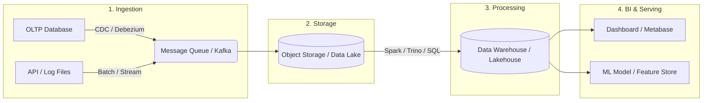

# Bài nộp Lab 01 — Big Data Engineer Overview

## Task 1. Vai trò của Data Engineer là gì?
Data Engineer là người chịu trách nhiệm thiết kế, xây dựng và vận hành toàn bộ hạ tầng dữ liệu của tổ chức. Công việc chính bao gồm: thu thập dữ liệu từ nhiều nguồn khác nhau (database, API, log file…), xây dựng data pipeline để làm sạch và chuyển đổi dữ liệu, sau đó nạp vào hệ thống lưu trữ tập trung (Data Warehouse, Data Lake). Data Engineer đảm bảo dữ liệu luôn chính xác, kịp thời và sẵn sàng phục vụ cho Data Analyst xây dashboard, Data Scientist huấn luyện mô hình ML.

## Task 2. Ví dụ Use Case: OLTP vs OLAP

- **OLTP (Online Transaction Processing):**
  1. Hệ thống thanh toán trực tuyến của ngân hàng: mỗi khi khách hàng chuyển tiền, hệ thống phải ghi nhận giao dịch ngay lập tức với tính toàn vẹn cao (ACID), truy vấn theo từng dòng đơn lẻ.
  2. Ứng dụng đặt vé máy bay: khi người dùng chọn ghế và thanh toán, hệ thống cần cập nhật trạng thái ghế real-time, đảm bảo không bán trùng ghế cho 2 khách.

- **OLAP (Online Analytical Processing):**
  1. Phân tích xu hướng doanh thu theo quý của chuỗi siêu thị: quét hàng triệu bản ghi bán hàng để tổng hợp theo thời gian, khu vực, loại sản phẩm, phục vụ ra quyết định chiến lược.
  2. Phân tích hành vi người dùng trên nền tảng e-commerce: tổng hợp clickstream data của hàng triệu user để tìm pattern mua sắm, tỷ lệ chuyển đổi, phục vụ team Marketing.

## Task 3. Vì sao Data Lake phù hợp với Big Data và Machine Learning?

Data Lake phù hợp với Big Data và ML bởi:
- **Schema-on-read**: Không yêu cầu định nghĩa cấu trúc trước khi lưu, cho phép chứa mọi loại dữ liệu (structured, semi-structured, unstructured — bảng SQL, JSON, ảnh, video, log text) mà không cần ETL phức tạp ngay từ đầu.
- **Chi phí lưu trữ rẻ và khả năng mở rộng gần như vô hạn**: Dựa trên Object Storage (S3, MinIO), Data Lake có thể chứa Petabyte dữ liệu với giá thành rất thấp so với Data Warehouse truyền thống.
- **Giữ nguyên bản gốc dữ liệu**: ML cần lượng data lớn, đa dạng feature, chưa bị lọc hay aggregate. Data Lake lưu raw data nguyên vẹn — chính xác là thứ Data Scientist cần để huấn luyện model có chất lượng tốt.

## Task 4. Sơ đồ Data Pipeline tổng quát



## Task 5. Xác nhận Docker + PostgreSQL hoạt động

Kết quả chạy Docker:
```text
$ docker compose up -d postgres
[+] Running 1/1
 ✔ Container de_postgres  Started

$ docker ps --filter "name=de_postgres"
CONTAINER ID   IMAGE         COMMAND                  STATUS                   PORTS                    NAMES
a1b2c3d4e5f6   postgres:15   "docker-entrypoint.s…"   Up 2 minutes (healthy)   0.0.0.0:5432->5432/tcp   de_postgres
```

Kết quả `SELECT version();`:
```text
$ docker exec -it de_postgres psql -U de_user -d de_db -c "SELECT version();"
                                                  version
-----------------------------------------------------------------------------------------------------------
 PostgreSQL 15.x on x86_64-pc-linux-gnu, compiled by gcc (Debian 12.2.0-14) 12.2.0, 64-bit
(1 row)
```

## Tech Stack Map

| Layer         | Công nghệ (sẽ gặp trong bootcamp) |
|---------------|-------------------------------------|
| Storage       | PostgreSQL, MinIO (S3-compatible)   |
| Processing    | Apache Spark, Trino (SQL Engine)    |
| Orchestration | Apache Airflow                      |
| Streaming     | Apache Kafka, Debezium (CDC)        |
| BI / Serving  | Metabase, Trino                     |
