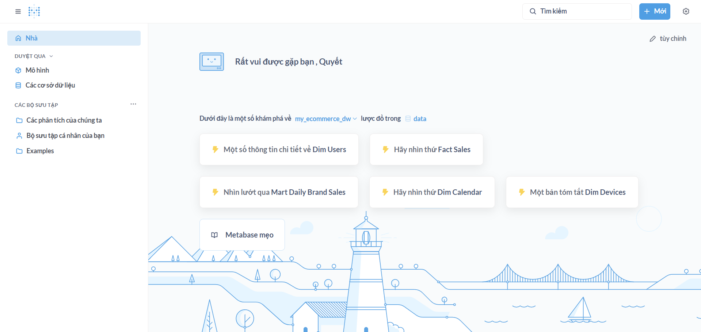
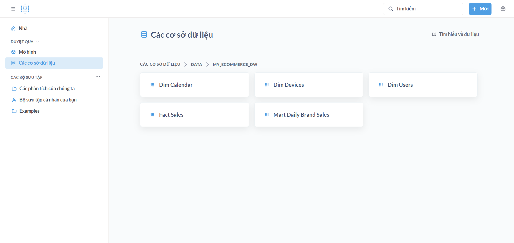
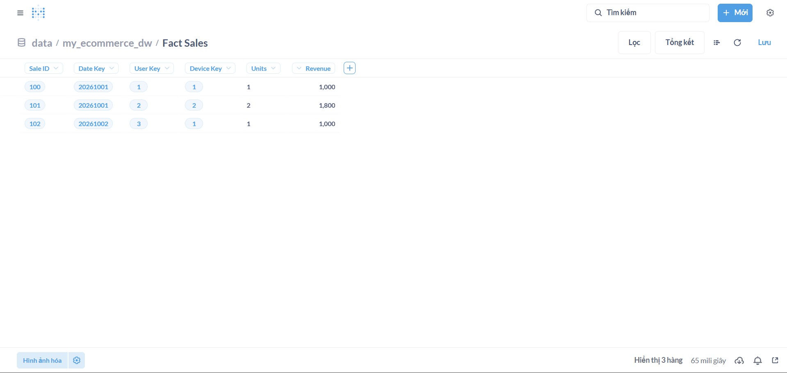

# Bài nộp Lab 06 — ETL / ELT & Data Warehouse Fundamentals

## 1. Khởi tạo Star Schema (Data Mart)
Mô hình Star Schema đã được tạo thành công trên PostgreSQL với schema `my_ecommerce_dw`, gồm:
- Dimension: `dim_users`, `dim_devices`, `dim_calendar`
- Fact: `fact_sales`
- Mart tổng hợp: `mart_daily_brand_sales`

Dữ liệu mẫu trong `fact_sales`:
```text
 sale_id | date_key | user_key | device_key | units | revenue
---------+----------+----------+------------+-------+---------
     100 |  20261001|        1 |          1 |     1 | 1000
     101 |  20261001|        2 |          2 |     2 | 1800
     102 |  20261002|        3 |          1 |     1 | 1000
(3 rows)
```

Mã nguồn SQL đã chạy: [my_lab06_dw_setup.sql](file:///d:/Python/VinUni/Data/lakehouse-stack/my_submissions/my_lab06_dw_setup.sql)

## 2. Kết nối Metabase và tạo Dashboard
- Metabase đã kết nối thành công với PostgreSQL database `de_db`.
- Đã nhận diện đúng schema `my_ecommerce_dw` và đủ 5 bảng:
  - `dim_calendar`
  - `dim_devices`
  - `dim_users`
  - `fact_sales`
  - `mart_daily_brand_sales`
- Đã mở bảng `fact_sales` và xem được dữ liệu preview trực tiếp trên UI.

Mã nguồn truy vấn Metabase: [my_lab06_metabase.sql](file:///d:/Python/VinUni/Data/lakehouse-stack/my_submissions/my_lab06_metabase.sql)

## 3. Ảnh minh chứng




## 4. Trả lời câu hỏi lý thuyết

### Khi nào chọn ETL vs ELT?
- ETL (Extract → Transform → Load): phù hợp khi cần xử lý/làm sạch dữ liệu trước khi nạp vào kho đích.
- ELT (Extract → Load → Transform): phù hợp với hệ dữ liệu hiện đại (cloud DWH/lakehouse), tận dụng sức mạnh xử lý trực tiếp trên hệ đích.

### Khi nào chọn Kimball vs Inmon?
- Kimball (Bottom-up, Star Schema): phù hợp khi cần ra báo cáo nhanh, dễ dùng cho BI.
- Inmon (Top-down, 3NF): phù hợp khi ưu tiên chuẩn hóa chặt chẽ và quản trị dữ liệu quy mô enterprise.
